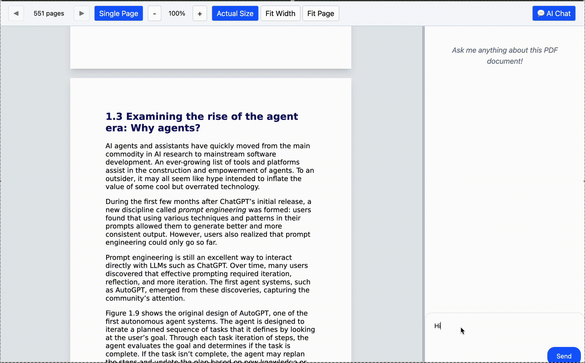

## PDFChat — PDF reader with ai chat
PDFChat is a desktop PDF reader that lets you open PDFs, and chat with AI about the content.Built with Electron for the desktop shell, React for the UI, and LangChain for AI-powered retrieval-augmented generation (RAG).



### Features
- **PDF viewing**: Single page and continuous modes, zoom, fit-to-width/page, page navigation.
- **AI chat sidebar**: Resizable, toggleable chat panel.
- **Context menu on selection**: Copy text or send selection directly to the AI chat.
- **RAG**: Ask about topics from loaded pdf

### Tech stack
- **Electron**, **React**, **TypeScript**, **Vite**, **Zustand** for state management, **react-pdf** for pdf rendering, **LangGraph** for RAG

## Getting started

### Prerequisites
- Node.js 18+ (recommended 20+)
- npm 8+

### Install
```bash
npm ci
```

### Run in development
```bash
npm run dev
```
This starts:
- Electron with `NODE_ENV=development`
- Vite dev server on `http://localhost:3000`


## AI integration
Uses gemini models.  Add your API key in .env
```
GOOGLE_API_KEY=<your key>
```


